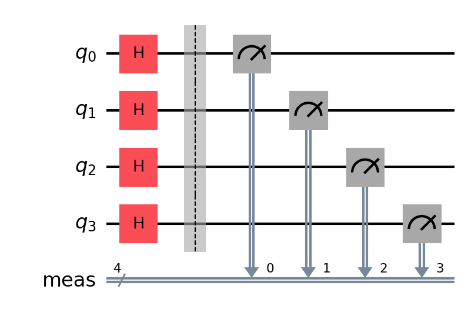
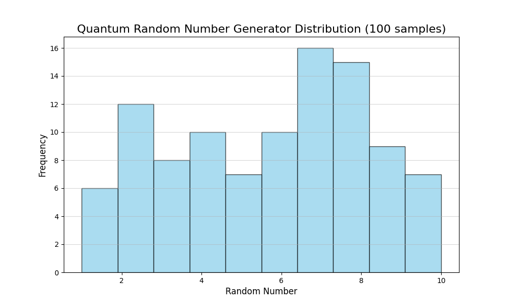
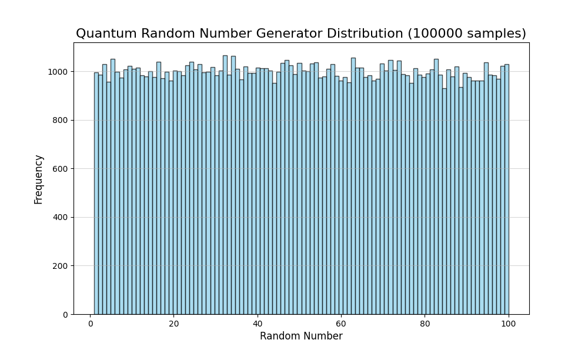

# Quantum Random Number Generator (QRNG)

A Python-based tool that leverages the principles of **Quantum Mechanics** to generate true random numbers. Unlike classical pseudo-random number generators (PRNGs) which rely on deterministic algorithms, this project utilizes the fundamental indeterminacy of quantum state measurements.

Built with **IBM Qiskit** and **Matplotlib**.

## Features

* **True Randomness:** Uses quantum superposition (Hadamard gates) to generate entropy.
* **Custom Range:** Generate integers within any specified interval (e.g., 1 to 10, or 1 to 1,000,000).
* **Circuit Visualization:** Automatically generates and saves the quantum circuit diagram used for the calculation.
* **Statistical Benchmarking:** Built-in tools to verify the uniformity of the distribution via histograms.
* **Command Line Interface (CLI):** Robust argument parsing for easy interaction.

## Installation

Ensure you have **Python 3.10+** (Python 3.12 recommended).

1.  **Clone the repository:**
    ```bash
    git clone https://github.com/numaguiot/quantum-random-generator.git
    cd quantum-rng
    ```

2.  **Create a virtual environment:**
    ```bash
    python3.12 -m venv .venv
    source .venv/bin/activate  # On Windows: .venv\Scripts\activate
    ```

3.  **Install dependencies:**
    ```bash
    pip install qiskit qiskit-aer matplotlib pylatexenc
    ```

## Usage

Run the script directly from your terminal.

### 1. Basic Generation
Generate a number between 0 and 100 (default):
```bash
python rng_quantique.py
```

### 2. Custom Range
Generate a number between 1 and 1000:
```bash
python rng_quantique.py --min 1 --max 1000
```

### 3. Circuit Visualization
Generate a number and save the circuit diagram:
```bash
python rng_quantique.py -i -q 5
```
```
-i, --image      Enables image generation of the quantum circuit.
-q, --qubits     Specifies the number of qubits to use.
```
### 4. Statistical Benchmarking 
Run a simulation to verify randomness distribution:
```bash
python rng_quantique.py --min 1 --max 10 -b -it 1000
```
```
-b, --benchmark     Enables benchmarking mode.
-it, --iterations   Number of iterations for benchmarking.
```
## How It Works

The core logic relies on the Hadamard Gate (H-gate).
1. Initialize qubits to |0⟩ state.
2. Apply H-gate to each qubit to create superposition. |+⟩ = (|0⟩ + |1⟩)/√2.
3. Measure the qubits, collapsing them to either |0⟩ or |1⟩ with equal probability of 50%.
4. The binary results are converted to decimal and mapped to the specified range.

**Quantum Circuit Diagram**

Below is an example of a 4-qubit circuit generated by the program.


### Statistical Validation and The Law of Large Numbers

To prove the quality of the randomness, I utilize the benchmark mode. These tests illustrate the importance of sample size (The Law of Large Numbers) in achieving a uniform distribution.

**Test A: Small Sample Size (100 iterations)**
* **Command:** `python rng_quantique.py --min 1 --max 10 -b -it 100`
* **Parameters:** Range 1-10, 100 iterations
* **Observation:** The histogram shows significant fluctuations, indicating that the randomness is not uniformly distributed in small samples.


**Test B: Large Sample Size (100,000 iterations)**
* **Command:** `python rng_quantique.py --min 1 --max 100 -b -it 100000`
* **Parameters:** Range 1-100, 100,000 iterations
* **Observation:** The histogram appears much smoother and more uniform, demonstrating that larger samples yield better randomness quality.


## License
This project is open-source and available under the MIT License.
